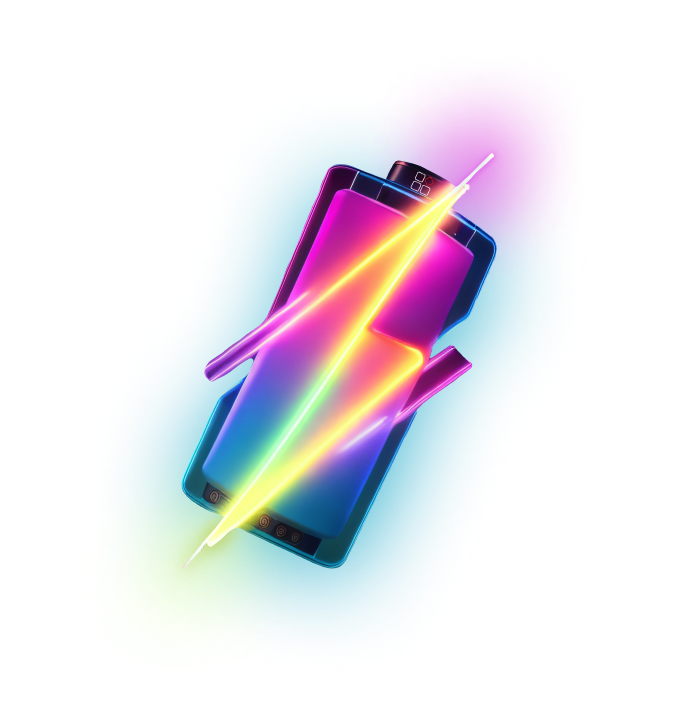

<h1 align='center'>Vite SSR BOOST</h1>

<p align="center">
    
</p>

### Key features:

- Develop ⚡charged⚡ server side applications with React streaming 💨 support.
- Unlocks Suspense for server side applications.
- Switch between SPA and SSR in 1 second.
- Charged CLI out of box.
- Very easy to migrate, very easy to use.
- All the power of [vite](https://vitejs.dev/)⚡
- All the power of [react-router](https://reactrouter.com/)🛣

<p align="center">
  
  
  
  
  
  
  
  
  
</p>

## Table of contents
- [Getting started](#getting-started)
- [How to use](#how-to-use)
- [Plugin options](#plugin-options)
- [Useful imports](#useful-imports)
- [CLI](#cli)
- [Example](#demo)
- [Bugs and feature requests](#bugs-and-feature-requests)
- [License](#license)

## Getting started

The package is distributed using [npm](https://www.npmjs.com/), the node package manager.

```
npm i --save @lomray/vite-ssr-boost
```

## How to use

1. Add plugin to vite config:
```typescript
/**
 * vite.config.ts
 */

import { defineConfig } from 'vite'
import react from '@vitejs/plugin-react'
/**
 * Import plugin
 */
import SsrBoost from '@lomray/vite-ssr-boost/plugin';

// https://vitejs.dev/config/
export default defineConfig({
  /**
   * Change root not necessary, but more understandable
   */
  root: 'src',
  publicDir: '../public',
  build: {
    outDir: '../build',
  },
  /**
   * Put here
   */
  plugins: [SsrBoost(), react()],
});

```
2. Create `client` entrypoint:

```typescript jsx
/**
 * src/client.tsx
 */
import entryClient from '@lomray/vite-ssr-boost/browser/entry';
import App from './App.tsx'
import routes from './routes';

void entryClient(App, routes, {
  /**
   * Client configuration (optional)
   */
  init: () => {}
});
```

3. Create `server` entrypoint:

```typescript jsx
/**
 * src/server.ts
 */
import entryServer from '@lomray/vite-ssr-boost/node/entry';
import App from './App';
import routes from './routes';

export default entryServer(App, routes, {
  /**
   * Request timeout (If your backend is slow, increase this value)
   */
  abortDelay: 15000, // default: 15000 (ms)
  /**
   * Server configuration (optional)
   */
  init: () => ({
    /**
     * (optional). Called once after express server creation.
     * E.g. use for configure express middlewares
     */
    onServerCreated: () => {},
    /**
     * (optional). Called on each incoming request.
     * E.g. configure request state, create state manager etc.
     */
    onRequest: async () => {},
    /**
     * (optional). Called when react router and it's context was created.
     * E.g. here you can switch stream depends on req.headers, for search crawlers you can disable stream.
     */
    onRouterReady: () => {},
    /**
     * (optional). Called when application shell is ready to send on client.
     * E.g. here you can modify header or footer.
     */
    onShellReady: () => {},
    /**
     * (optional). Called when application shell or suspense resolved and sent to the client.
     * E.g. here you can add some payload like custom state (any manager state) to response. 
     */
    onResponse: () => {},
    /**
     * (optional). Called when application shell or all html (depends on stream option) is ready to send on client.
     * E.g. here you can send any context or state to client.
     */
    getState: () => {},
  }),
}, App);
```

4. Replace `package.json` scripts:

```json
{
  ...
  "scripts": {
    "develop": "ssr-boost dev",
    "build": "ssr-boost build",
    "start:ssr": "ssr-boost start",
    "start:spa": "ssr-boost start --only-client",
    "preview": "ssr-boost preview"
  },
  ...
}
```

5. Let's do the magic:

```shell
npm run develop
```

## Plugin options
```typescript
import SsrBoost from '@lomray/vite-ssr-boost/plugin';
import type { FCRoute } from '@lomray/vite-ssr-boost/interfaces/fc-route';

/**
 * Configuration
 */
SsrBoost({
  /**
   * index.html file path
   */
  indexFile: 'index.html', // default: index.html
  /**
   * Server entrypoint file
   */
  serverFile: 'server.ts', // default: server.ts
  /**
   * Client entrypoint file
   */
  clientFile: 'client.ts', // default: client.ts
  /**
   * Add tsconfig aliases to vite config aliases
   */
  tsconfigAliases: true, // default: true
})
```

## Useful imports
```typescript
/**
 * Components
 */
// Navigate component based on react-router-dom with server-side support
import Navigate from '@lomray/vite-ssr-boost/components/navigate';
// Change server response status
import ResponseStatus from '@lomray/vite-ssr-boost/components/response-status';
// Scroll page to top after navigate
import ScrollToTop from '@lomray/vite-ssr-boost/components/scroll-to-top';
// HOC for wrap component in Suspense
import withSuspense from '@lomray/vite-ssr-boost/components/with-suspense';

/**
 * Helpers
 */
// Get server state (e.g. state manager) on client side
import getServerState from '@lomray/vite-ssr-boost/helpers/get-server-state';

/**
 * Interfaces
 */
// interfaces for route components
import type { FCRoute, FCCRoute } from '@lomray/vite-ssr-boost/interfaces/fc-route';
// interface for define routes
import type { TRouteObject } from '@lomray/vite-ssr-boost/interfaces/route-object';
```

## CLI
Explore all commands and options:
```shell
ssr-boost -h
```

## WARNING
Route imports of the following types are supported:
```typescript jsx
import { RouteObject } from 'react-router-dom';
import HomePage from './pages/home';

const importPath = './pages/home';

const routes: RouteObject[] = [
  {
    path: '/home',
    Component: HomePage, // support
    element: <AppLayout />, // support
    lazy: () => import('./pages/home'), // support
    lazy: () => import(importPath), // not support
    lazy: () => { // not support
        return import('./pages/home');
    } 
  }
];
```

## Demo
Explore [demo app](https://github.com/Lomray-Software/vite-template) to more understand.

## Bugs and feature requests

Bug or a feature request, [please open a new issue](https://github.com/Lomray-Software/vite-ssr-boost/issues/new).

## License
Made with 💚

Published under [Apache License](./LICENSE).
